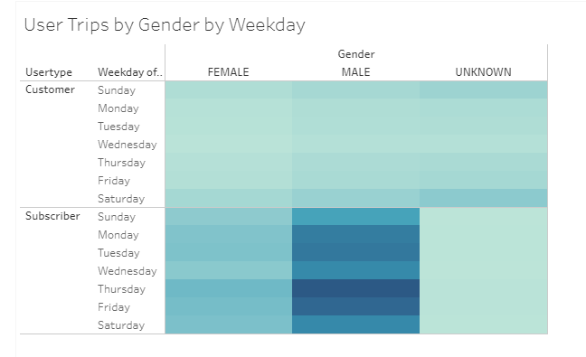

# bikesharing

## Overview

## Results

### Checkout Times For Users 
The length of time that bikes are checked out for all riders. Most rides last between fifteen to thirty minutes. 
  

### Checkout Times By Gender 
The length of time that bikes are checked out for each gender.  Men are the majority riders by a large margin. 
  

### Trips By Weekday For Each Hour 
The number of bike trips by weekday for each hour of the day as a heatmap.  There are two peak times, between 7 AM - 9 AM, and between 5 PM - 6 PM. 
  

### Trips By Gender (Weekday Per Hour) 
The number of bike trips by gender for each hour of each day of the week as a heatmap. Men tend to use the bikes the most between 5 PM - 6 PM during the week. 
  

### User Trips By Gender By Weekday 
The number of bike trips by gender for each hour for each day of the week as a heatmap.  Men use the bikes the most during the week.. 
  

## Summary
