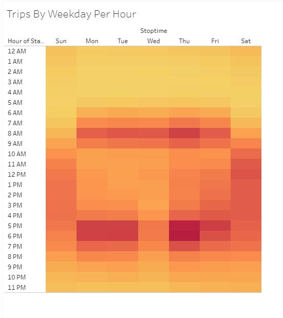

# bikesharing

## Overview

## Results  

### Checkout Times For Users 
In this visualization, I graphed the length of time that bikes are checked out for all riders. The visual shows us that most rides last between fifteen to thirty minutes. 
  

### Checkout Times By Gender 
In this visualization, I graphed the length of time that bikes are checked out for each gender.  This visual reveals that Males are the majority riders by more than 3X. 
  

### Trips By Weekday For Each Hour 
In this visualization, I graphed the number of bike trips by weekday for each hour of the day as a heatmap.  The weekdays show us two peak times - first between 7 AM - 9 AM, then between 5 PM - 6 PM. 
  

### Trips By Gender (Weekday Per Hour) 
In this visualization, I graphed the number of bike trips by gender for each hour of each day of the week as a heatmap.  The darker read indicates a high saturation - Males are really using the bikes between 5 PM - 6 PM during the week. 
  

### User Trips By Gender By Weekday 
In this visualization, I graphed the number of bike trips by gender for each hour for each day of the week as a heatmap.  Male Subscribers are showing a high usage rate during the week - a very consistent theme through our analysis using different visualizations. 
  

### 

## Summary
